<div align="center">

# 𓁢 NILE — Narrating Immersive Legacies of Egypt

### A Virtual Reality museum where Ramesses II answers you back — in his own voice.


-brightgreen)


**Graduation Project · Supervised by Dr. [Reda ElBasiony](https://scholar.google.com/citations?user=dRS7pwQAAAAJ&hl=en)**

</div>

<br>

<p align="center">
  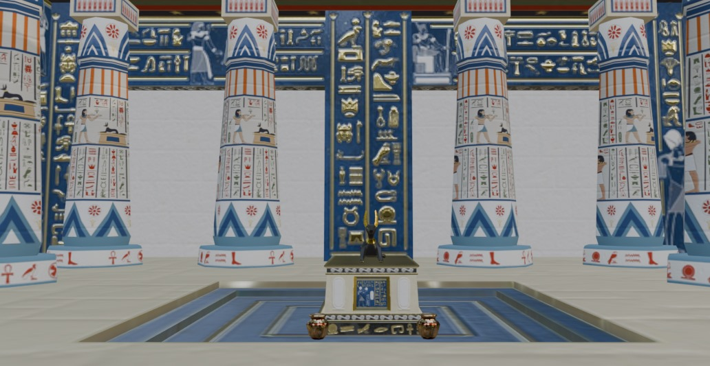
</p>

<br>

## What is NILE?

For three thousand years, Ramesses II has been silent — a face in stone, a name on a cartouche. **NILE puts him back in the room.**

NILE is a next-gen spatial computing virtual museum that builds **digital twins of ancient Egyptian mummies - initiated with Ramesses II - and their documented artifacts**, then lets you talk to them. Walk into a reconstructed Egyptian temple, stand in front of a statue of Ramesses II — modeled from his actual mummified remains, not a generic sculpt — and simply **talk to him**. Ask about his wife Nefertari, his battles, or Abu Simbel, and an AI agent, grounded in real Egyptological sources and speaking entirely in character, answers you back in real time, out loud, through a lip-synced avatar. A second pharaoh, **Akhenaten**, is currently in development as the next digital twin to join the experience.

It's a full-stack project split across two disciplines that had to work in lockstep: a **conversational AI agent** (speech-to-text → retrieval-augmented generation → text-to-speech, running low-latency neural speech pipelines end to end) and a **hand-built 3D world** (Blender-sculpted characters and environments, brought to life in Unity for VR).

The project was evaluated twice by the university council and received **A+ both times.**

> Built in collaboration with **Alexandria University's Faculty of Archaeology** staff, who reviewed and confirmed the historical accuracy of the project's source material and artifacts, and **Flyover Zone**, a U.S.-based VR/AR education technology company — a two-way exchange where our team contributed AI integration work to their VR projects, and their team supported ours with VR development guidance in their core area of specialization.

---

## 🏛️ Why this exists

Physical museums are constrained by space, fragile artifacts, and static exhibits — and they're increasingly disconnected from how younger, digitally-native audiences want to engage with history. Countless artifacts and sites are also at real risk from decay, conflict, and time itself.

NILE's answer: rebuild the experience in VR, and replace the placard with a conversation. No tour guide required — you ask, Ramesses answers, in character, in real time.

---

## 🎬 See it in action

<table>
<tr>
<td width="50%">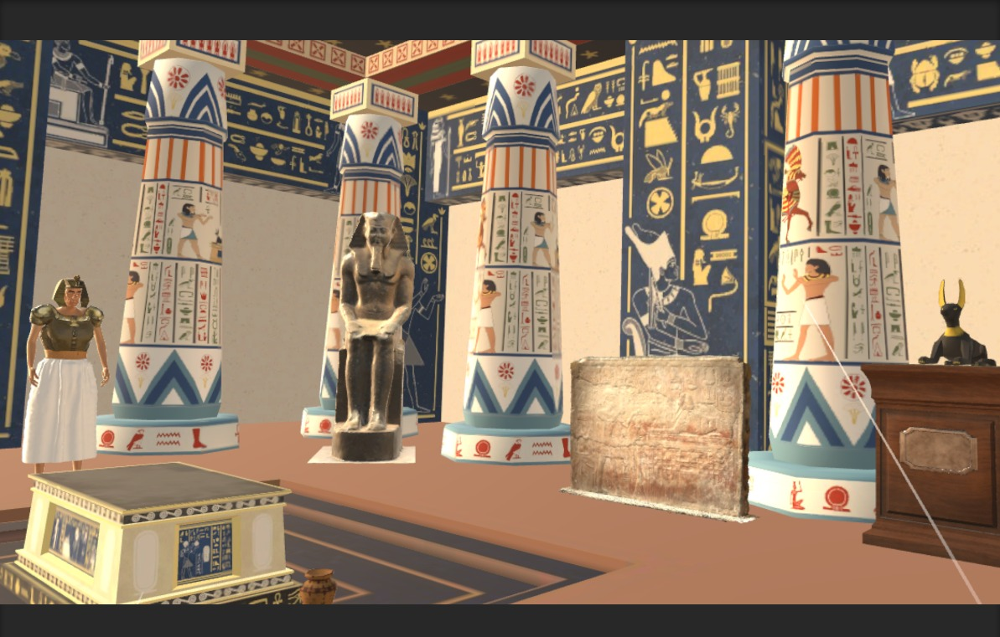</td>
<td width="50%">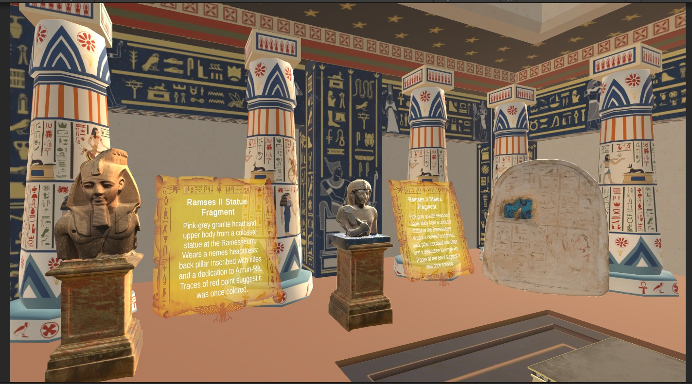</td>
</tr>
<tr>
<td align="center"><sub>The museum room — statues, sarcophagus, and Anubis on display</sub></td>
<td align="center"><sub>Interactive plaques give real Egyptological context on each artifact</sub></td>
</tr>
<tr>
<td width="50%">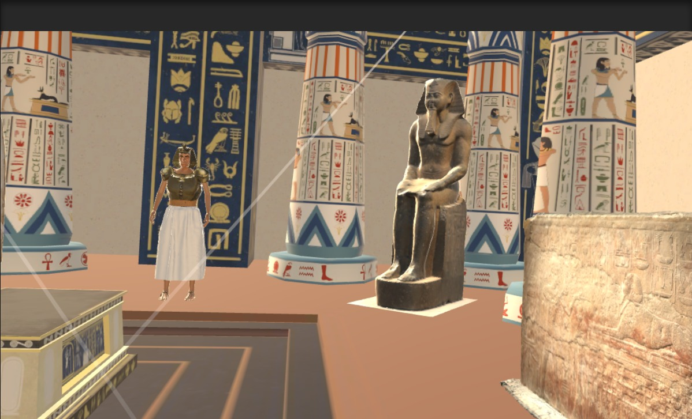</td>
<td width="50%">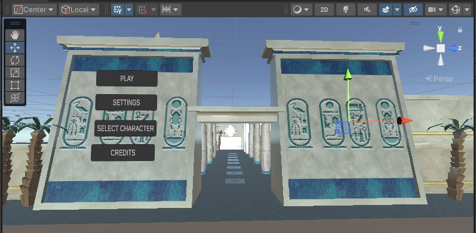</td>
</tr>
<tr>
<td align="center"><sub>Approaching the seated Ramesses II statue</sub></td>
<td align="center"><sub>Play · Settings · Select Character · Credits</sub></td>
</tr>
</table>

---

## 🧩 How it fits together

NILE is two systems, built by two sub-disciplines, meeting in Unity:

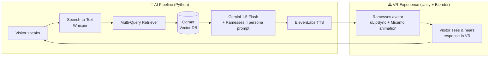

The offline half — turning a real Egyptology book into something the AI can accurately draw from:

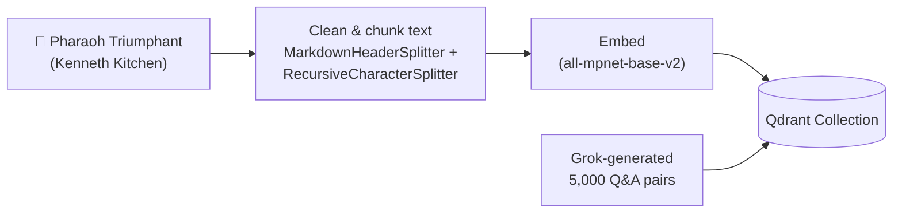

---

## 🧠 The AI Agent

Under the hood this is a retrieval-augmented generation (RAG) system — that's the precise technical description, and it's what the tables below detail. But it goes a step past a plain lookup-and-answer RAG pipeline: it reformulates and routes questions before retrieving, and it holds a real conversation across turns rather than answering each message in isolation, enabling a conversational memory — which is why the project describes it as an **AI agent**.

### Data foundation
The knowledge base isn't scraped from random web articles — early experiments showed that produced inconsistent, unreliable answers. Instead, we built it from a single authoritative source: **"Pharaoh Triumphant: The Life and Times of Ramesses II" by Kenneth Kitchen**, the standard scholarly biography. This was supplemented with a **5,000-pair Q&A dataset** generated across five categories (Legacy & Achievements, Life & Beliefs, Politics & Power, Historical Context, and Geography/Resources) to give the model broader conversational coverage.

### The RAG pipeline

| Component | Choice | Why |
|---|---|---|
| Framework | LangChain | Orchestrates the full retrieval → generation chain |
| Embeddings | `sentence-transformers/all-mpnet-base-v2` | Dense semantic search over the knowledge base |
| Vector DB | Qdrant | See evolution story below |
| Generation LLM | Gemini 1.5 Flash | Best latency/accuracy/RAG-support balance after testing alternatives |
| Retrieval enhancement | Gemini-powered Multi-Query Retriever | Rephrases each question multiple ways to catch more relevant context |
| Complexity routing | DistilBERT question-complexity classifier | Routes simple vs. complex questions differently before retrieval |
| Speech-to-Text | OpenAI Whisper (Whisper-1 API in production; Faster-Whisper evaluated locally during development) | Reliable transcription with minimal setup overhead |
| Text-to-Speech | ElevenLabs (`eleven_flash_v2_5` / turbo v2) | Most natural, expressive voice of everything evaluated |
| Backend | FastAPI | `/chat-with-audio`, `/chat-with-artifact`, `/ask`, `/transcribe`, `/reset-memory` |
| Memory | Sliding-window conversation buffer (k=5) | Keeps context across a multi-turn conversation without unbounded growth |

**The vector database story:** we didn't land on Qdrant by default — we went through **Pinecone → Chroma → Qdrant**, hitting usage limits on the first and scalability limits on the second, before settling on Qdrant for its balance of scale, filtering, and clean LangChain/FastAPI integration.

### The LLM story: fine-tuning before landing on RAG

Production generation runs on Gemini 1.5 Flash today, but that's the result of real experimentation, not a first guess:

**Qwen2-0.5** was fine-tuned directly on the Ramesses II Q&A dataset using **Unsloth** and **LoRA** in **bnb 4-bit** quantization — a setup chosen specifically to enable efficient training and fast inference on limited hardware. We also separately trialed **LLaMA**. Both are real, benchmarked alternatives (see the RAGAS comparison below) — Gemini 1.5 Flash won out for production because of its combination of low latency, CPU efficiency, and strong native RAG support for a real-time VR experience, not because the fine-tuning work didn't pan out.

### Staying in character — and remembering you
A custom prompt constrains every response to Ramesses II's voice: first-person, majestic and poetic, historically consistent, with a touch of dry humor when the AI doesn't know something — rather than breaking character to say "I don't have that information."

The memory isn't just theoretical — here's an actual conversation from testing, where I introduced myself once, and Ramesses correctly recalls the name several turns later without being reminded:

<p align="center">
  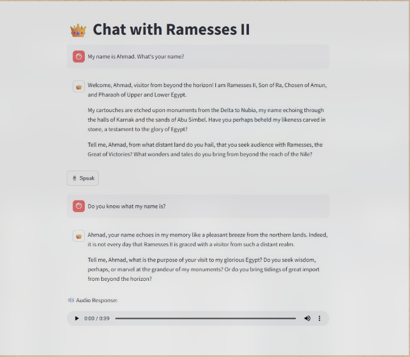
</p>

### Evaluation
The RAG pipeline was benchmarked with the **RAGAS framework** across five configurations before picking a winner:

| Configuration | Faithfulness | Answer Relevancy | Context Precision | Context Recall |
|---|---|---|---|---|
| Gemini — without query classification | 0.3527 | 0.6778 | 0.8594 | 0.9167 |
| **Gemini — with multi-retrieval** ⭐ | **0.7889** | **0.7181** | **0.9865** | **0.9167** |
| Gemini — without multi-retrieval | 0.2907 | 0.4968 | 0.8814 | 0.8750 |
| Qwen (base) | 0.3572 | 0.6839 | 0.9501 | 0.7708 |
| Qwen (fine-tuned) | 0.5791 | 0.4031 | 0.9407 | 0.9028 |

Voice pipeline benchmarks:

| Metric | Result |
|---|---|
| Whisper (Medium) ASR accuracy | **99.3%** |
| ElevenLabs pronunciation accuracy | **81.97%** (industry average: 70–85%) |
| ElevenLabs word error rate | **2.83%** (industry average: 3–5%) |
| STT latency | 0.53s |
| RAG chain latency | 0.97s |
| TTS synthesis | 2.05s |
| **Total round-trip latency** | **3.55s** (down from 4.44s — a ~20% optimization) |
| Backend throughput | Up to 83 concurrent requests/sec, 100+ simultaneous sessions |

---

## 🕹️ The Virtual Reality Experience

<table>
<tr>
<td width="50%">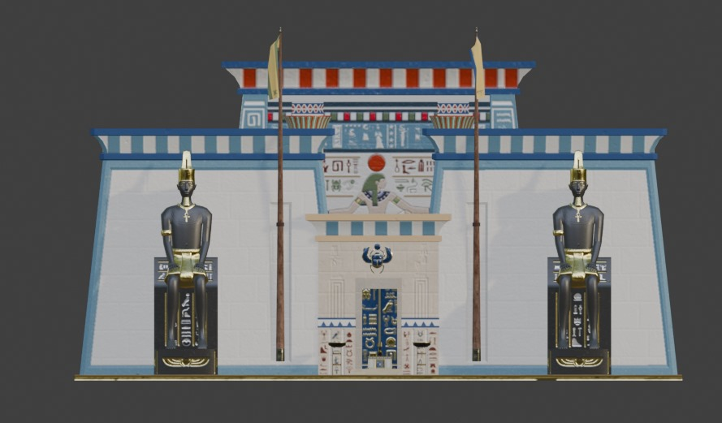</td>
<td width="50%">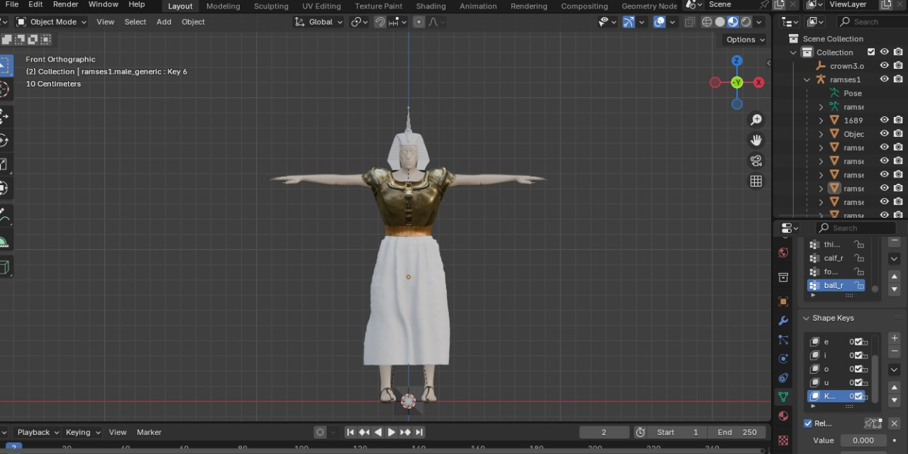</td>
</tr>
<tr>
<td align="center"><sub>Temple facade — sculpted and textured in Blender</sub></td>
<td align="center"><sub>Full-body rig + facial shape keys for lip-sync</sub></td>
</tr>
</table>

### From reference to rig
Ramesses II's likeness wasn't guessed — the base mesh came from Blender's MakeHuman add-on, sculpted and refined against his actual mummified remains and existing scholarly reconstructions. From there:

- **Rigging:** a full skeletal armature for body movement and posing
- **Shape keys:** custom facial blend shapes for expressions and lip-sync
- **Clothing:** period-accurate royal garments modeled and fitted to the character
- **Weight painting:** fine-tuned bone influence for natural deformation
- **Environment:** the temple room's walls and floors were UV-mapped with high-resolution ancient Egyptian artwork and motifs for historical atmosphere

### Bringing it into Unity
Unity (2022.3.45f1) is where everything meets: the Ramesses model is animated via **Mixamo** with **uLipSync** driving mouth movement synced to the ElevenLabs audio, wired directly to the AI backend for real-time conversation, with teleportation-based movement (to avoid VR motion sickness) and a full interaction/trigger system built around scripts like `ArtifactButton`, `NetworkManager`, and `PushToTalkManager`.

**Target hardware:** Meta Quest 3, or PC VR with a minimum of an RTX 3060 and 16GB RAM, on Windows 10/11.

The full content pipeline behind the scenes curated **1,200+ historical artifact references across 12 sources**, organized under a 53-category metadata framework, feeding into **18 thematic exhibition spaces** built in Unity — of which the AI-guided Ramesses II experience is the flagship, fully-interactive centerpiece.

<p align="center">
  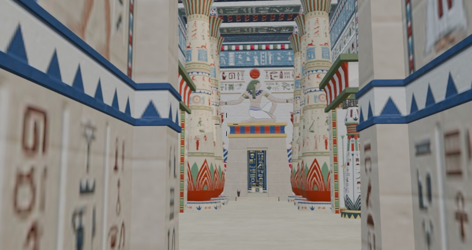
</p>

---

## 🗂️ Repository structure

This repository is the **AI backend** — the RAG pipeline, voice processing, and FastAPI server. The **3D/VR half** (Blender assets + Unity project) lives in a teammate's repository and is linked here as a Git submodule, so both halves of the project are discoverable from one place:

```
NILE-Narrating-Immersive-Legacies-of-Egypt/
├── main.py                    # FastAPI backend — the current production entry point
├── Ramesses_rag_stone.py      # RAG pipeline: retrieval + generation
├── Text_to_speech.py          # ElevenLabs TTS integration
├── transcribe.py              # Speech-to-text integration
├── requirements.txt
└── vr-unity-blender/          # → submodule: github.com/Desoky231/Ramses-VR
```

---

## 🚧 What's next

**Akhenaten** — a second pharaoh digital twin — is currently in development, extending the same RAG-agent-and-avatar pipeline to a new historical figure and voice.

---

## 🏆 Recognition

Evaluated twice by the university graduation project council — **A+ in both the first and second evaluations.**

---

## 📚 Key references

The RAG design and evaluation methodology draw on published research, including the RAGAS framework for automated RAG evaluation (Es et al., 2023) and current work on persona-consistent dialogue generation. Full citation list available in the project documentation.

---

## 📄 License

**All rights reserved.** This repository is shared publicly for portfolio and demonstration purposes. No part of the code, assets, or content may be reused, redistributed, or modified without explicit permission from the authors.
